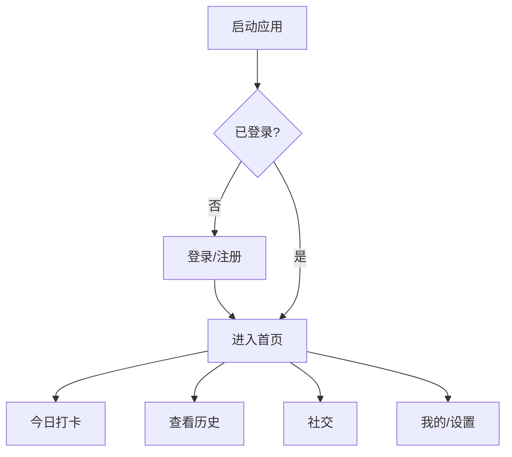
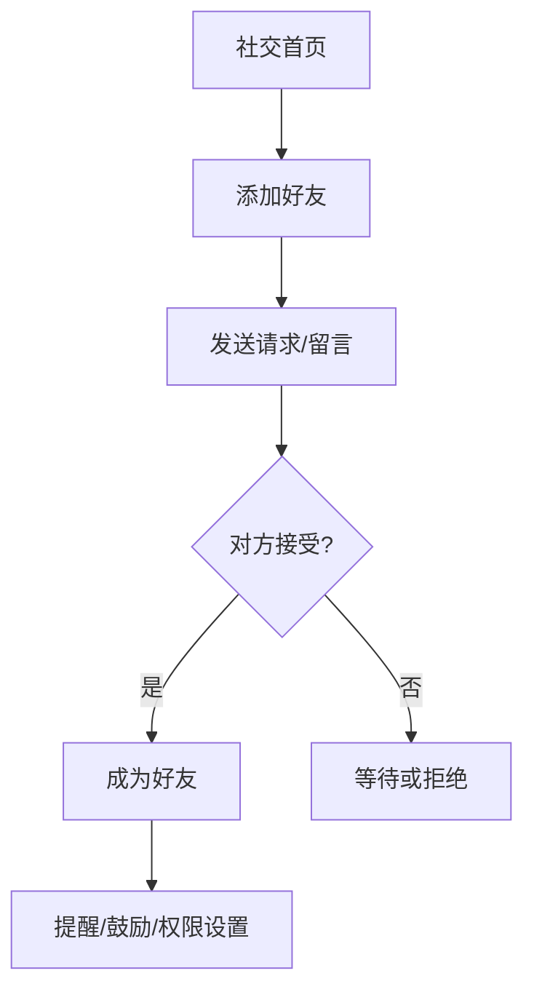
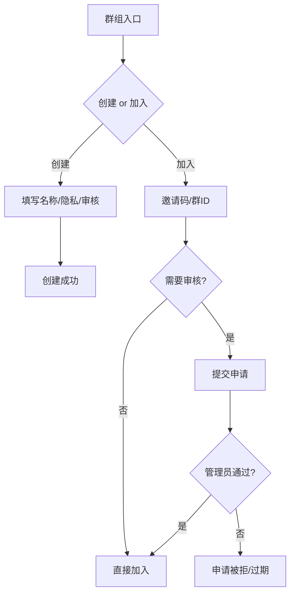

# SiLeMe App PRD（全应用）

## 变更记录 / 待更新

模板（每条一行）：
- YYYY-MM-DD | 变更点 | 影响范围（功能/接口/数据/交互）

近期变更：
- 2026-01-21 | 前端结构重构（页面/sections/hooks 细分） | 交互/工程结构
- 2026-01-21 | 新增前端结构/项目上下文文档 | 文档
- 2026-01-21 | PRD 拆分版移除，保留合并版 | 文档

实现补充（待并入正文）：
- 站内通知按好友/群组折叠展示，支持全部已读
- 群组：公开/私密、邀请码加入、入群审核、群公告编辑、群鼓励墙、群提醒
- 好友：申请留言、权限开关（可看详情/可提醒）

待更新：
- TODO：记录与现有实现不一致的功能点
- TODO：新增功能点同步补充到对应章节
- TODO：接口/数据模型变更同步更新

---

## 1. 背景与目标
SiLeMe 是一款轻量的「每日报平安打卡」应用，核心价值是“持续打卡 + 互相照应”。
目标是在不增加负担的前提下，让用户与亲友/群组确认彼此状态，并通过提醒与鼓励提升连续打卡率。

**目标**
- 提升打卡率与连续天数
- 降低打卡成本，鼓励长期坚持
- 提供适度的社交监督与支持
- 保持隐私可控、最小暴露

**非目标**
- 不做强社交（私信、动态长文、陌生人强绑定）
- 不默认公开详细健康信息
- 不引入复杂的社交关系图谱

---

## 2. 术语
- 打卡：用户提交当日状态记录（睡眠/精力/心情/备注等）
- 连续天数：连续打卡天数
- 详情：睡眠、精力、心情、备注等字段
- 提醒：好友/群组发起的打卡提醒
- 鼓励：好友/群组发起的加油/打气
- 热力图：近 180 天打卡日历展示

---

## 3. 用户画像与场景
**画像**
- 个人用户：希望记录每日状态
- 家人/伴侣：想确认对方是否安全
- 同事/朋友：互相监督打卡

**典型场景**
- 忙碌一天忘记打卡：好友/群提醒
- 家人想确认平安：只看“今日是否打卡”
- 连续打卡达标：收到鼓励与支持

---

## 4. 体验原则
- 默认最小暴露（只展示状态）
- 操作最少步骤（提醒一键、鼓励一键）
- 限频与不打扰（提醒次数有限）
- 交互轻量、移动端优先

---

## 5. 功能范围与优先级
**P0（当前实现）**
- 注册/登录（手机号 + 密码 + mock 验证码）
- 每日打卡（当日唯一，重复提交更新）
- 统计概览（连续天数、平均睡眠、趋势图）
- 历史记录（最近 30 天、详情展开、可编辑最近 N 天）
- 热力图（最近 180 天）
- 个人设置（昵称/头像/联系方式、自动警报时间、遗产说明）
- 紧急联系人（首选 1 个、备选多个）
- 社交（好友添加、提醒/鼓励、站内通知）
- 群组（创建/加入、公告、成员、鼓励墙、提醒、入群审核）

**P1（次期）**
- 勋章/成就展示
- 更完整的群内互动（榜单、@提醒完善）

**P2（后期）**
- 附近匿名打卡广场
- 轻量动态流（仅“已打卡/连续天数”）

---

## 6. 功能需求（按模块）

### 6.1 账号与安全
- 注册、登录、刷新 token、退出
- 账号以手机号为主

### 6.2 打卡（首页）
- 今日打卡提交（幂等）
- 表单字段：睡眠、精力、心情、备注
- 今日记录可更新

### 6.3 统计与趋势
- 统计概览：连续天数、平均睡眠
- 趋势图支持 14/30/90 天切换
- 数据不足 5 天时不展示趋势线

### 6.4 历史
- 最近 30 天列表，默认显示 10 条，按钮加载更多
- 点击记录展开详情并可编辑
- 可编辑窗口：最近 N 天（默认 7 天，可配置）
- 热力图：最近 180 天打卡日历热力图

### 6.5 个人设置
- 昵称、头像、时区、微信/邮箱
- 自动警报时间
- 遗产说明

### 6.6 紧急联系人
- 首选 1 个、备选多个
- 支持头像上传

### 6.7 社交（好友）
- 添加好友（手机号 + 留言）
- 好友状态：待确认/已发送/已好友
- 权限开关：可看详情/可提醒
- 提醒与鼓励（限频）

### 6.8 站内通知
- 站内通知列表
- 按好友/群组折叠
- 未读标记、全部已读

### 6.9 群组
- 创建/加入群组
- 公开/私密群
- 入群审核开关
- 群公告（管理员可编辑）
- 群成员列表
- 群鼓励墙、群提醒

---

## 7. 关键交互（文字稿）

**打卡**
- 点击“打卡”提交当日记录
- 重复提交更新当前日期

**历史记录**
- 默认展示 10 条，可“加载更多”
- 点击记录展开详情，支持编辑

**好友**
- 添加好友：输入手机号 + 留言
- 权限开关：允许查看详情、允许提醒
- 提醒/鼓励：一键发送

**群组**
- 创建群组：名称 + 公开/私密 + 是否审核
- 加入群组：邀请码/群 ID
- 群详情：群公告、成员、操作按钮

---

## 7.1 关键流程（流程图）

---

## 7.2 关键交互稿（文字版）

**首页/打卡**
- 输入睡眠/精力/心情/备注，点击“打卡”
- 成功后显示今日状态与连续天数

**历史页**
- 默认展示 10 条，点击“加载更多”追加
- 点击某条展开详情，可编辑最近 N 天
- 数据不足 5 天不展示趋势图

**社交页**
- 添加好友：手机号 + 留言，提交后显示“已发送”
- 好友详情：权限开关（查看详情/允许提醒）
- 站内通知：按人/群组折叠，支持“全部已读”

**群组**
- 创建群：名称必填，隐私/审核开关
- 群详情：公告、成员、操作按钮
- 群鼓励页：鼓励墙 + 排行榜 + 发送鼓励

---

## 8. 规则与限制
- 每日打卡唯一；重复提交更新
- 趋势图 <5 天数据不显示
- 编辑窗口默认 7 天（可配置）
- 站内提醒频控（每天对同一好友限次）

---

## 9. 数据模型（简述）
- users
- checkins
- friendships
- friend_settings
- reminders
- encouragements
- notifications
- groups
- group_members

---

## 10. 接口设计（摘要）
- 认证：`/auth/register` `/auth/login` `/auth/refresh` `/auth/logout`
- 用户：`/me` `/me/profile` `/me/contacts`
- 打卡：`/checkins/today` `/checkins/{date}` `/checkins` `/checkins/stats`
- 统计：`/checkins/summary?days=`
- 好友：`/friends` `/friends/{id}` `/friends/{id}/permission` `/friends/{id}/remind` `/friends/{id}/encourage`
- 通知：`/notifications` `/notifications/{id}/read` `/notifications/read-all`
- 群组：`/groups` `/groups/{id}` `/groups/join` `/groups/{id}/announcement` `/groups/{id}/name`

---

## 11. 统计与埋点
- 打卡率与连续天数分布
- 提醒发送次数/触达率
- 鼓励互动次数
- 入群审核通过率

---

## 12. 风险与应对
- 隐私泄露：默认只展示状态 + 授权控制
- 过度打扰：提醒频控 + 权限开关
- 低活跃：鼓励墙、轻量提醒

---

## 13. 里程碑
- V1：打卡 + 历史 + 统计 + 个人设置
- V2：好友 + 提醒/鼓励 + 站内通知
- V3：群组 + 群鼓励
- V4：附近与动态流（可选）
